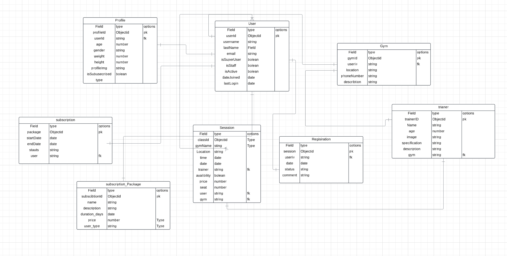
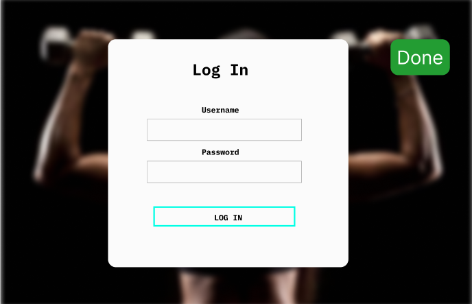
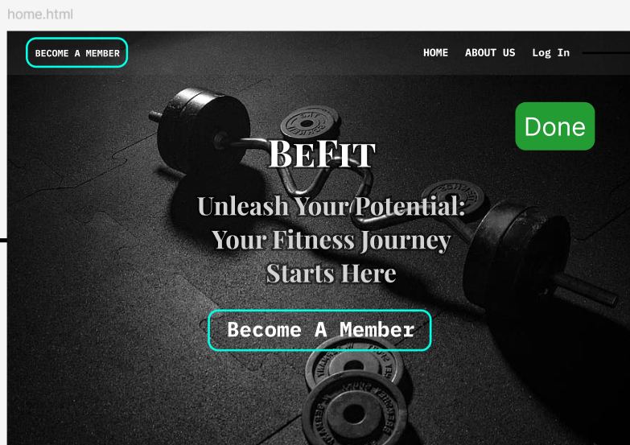
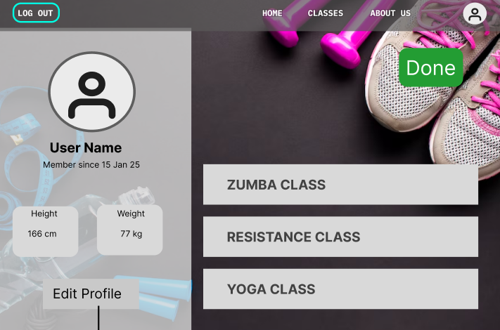
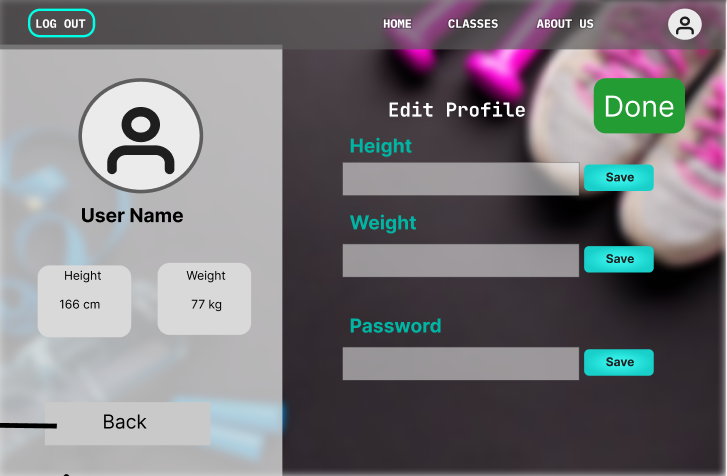
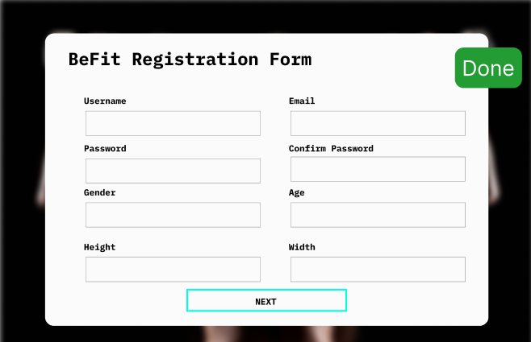
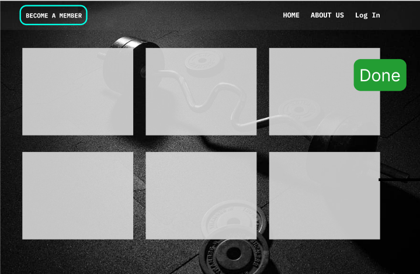

# Be Fit

**group names:**

- kawther Nasser
- Fatima Ebrahim
- Noor Husain

## **Project description :**

**Be Fit** is a comprehensive application designed to bridge the gap between gym owners and fitness enthusiasts. The app provides an intuitive platform for both gym owners and regular users, with distinct functionalities tailored to each group. Gym owners can manage their gyms, update class schedules, and offer membership plans, while users can easily discover gyms, book classes, choose trainers, and stay on top of their fitness goals. BE FIT aims to create a seamless and efficient experience for anyone seeking fitness solutions, whether they are gym owners or regular members.

## **Technologies used :**

- Django Framework
- Python
- PostSQL

## **Recourses :**

- [wireframe](https://www.figma.com/design/ttlGQJHvRbdl6sAbIZBxib/Untitled?node-id=0-1&t=9cGw6cHFX5shfxBw-1)

- [Trello](https://trello.com/invite/b/67876e15838f54102fba8d08/ATTI576a99d5228a16934ed3ad7311000430123AC680/befit)

## **Full Entity Relationship Diagram:**

## **Wireframe :**

Sign up / login page :

Home page :

Profile page :

Home page :

profile page :

## **Future enhancement :**

1. Integrate AI algorithms that create personalized workout and nutrition plans based on user preferences, fitness level, and goals. The app could adjust the plans dynamically based on progress and feedback.
2. Add social networking features where users can share their progress, achievements, and workout routines with friends or the broader BE FIT community. Users could also follow their favorite trainers or gym members.
